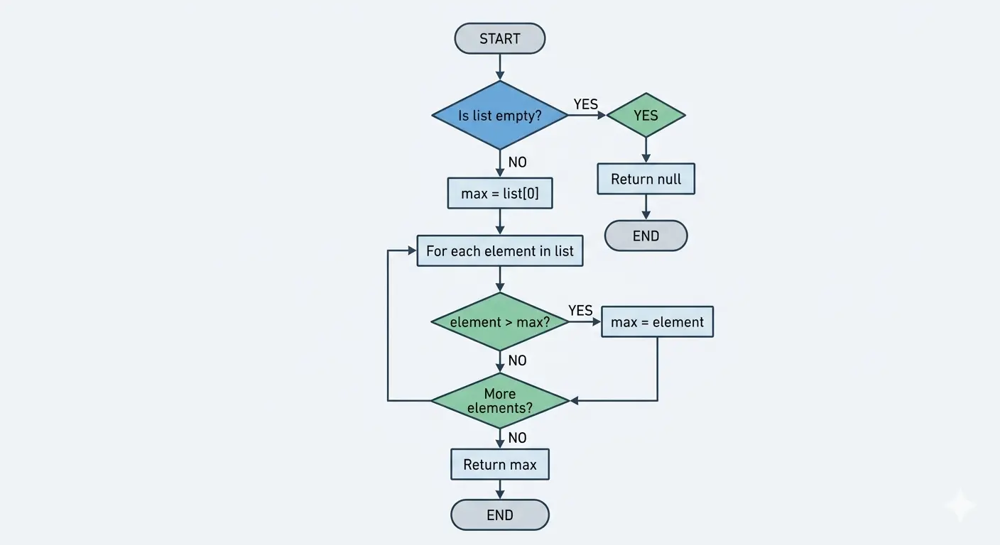
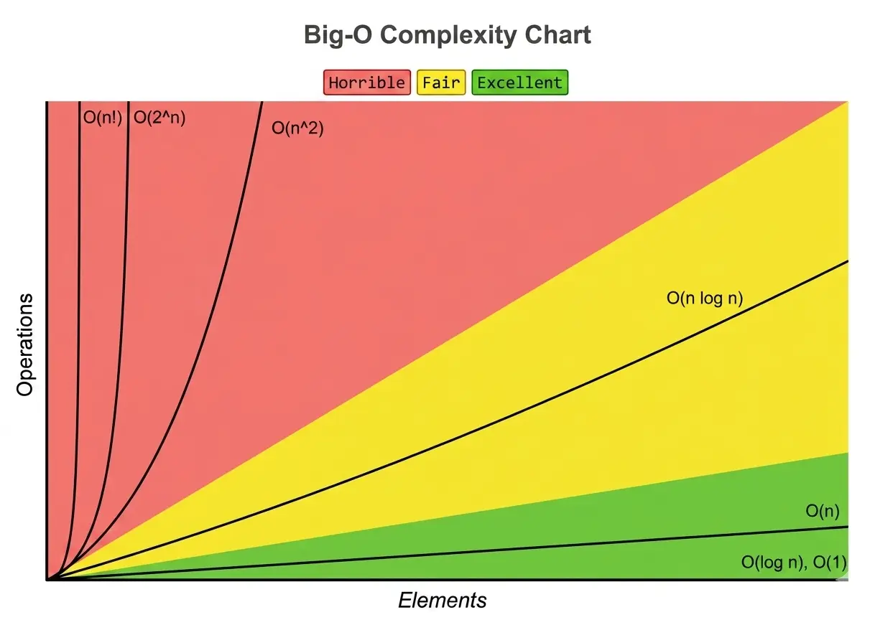

# Lesson 02 — Algorithms & Problem Solving

> [**Phase 1 — Foundations | Duration: 2 hours | Level: Intermediate**](../Lesson_01/Lesson_01_Computational_Thinking.md)

---

## Learning Objectives

By the end of this lesson, you will be able to:

- Define an algorithm precisely and evaluate its properties
- Read and write pseudocode and basic flowcharts
- Develop an intuitive understanding of Big-O notation and why it matters
- Recognize common algorithmic patterns (search, sort, traversal) and trace through them
- Analyze trade-offs between different algorithmic approaches

---

## [1. What Is an Algorithm?](https://en.wikipedia.org/wiki/Algorithm)

An algorithm is a **finite, deterministic sequence of well-defined steps** that transforms an input into an output. The key properties:

| Property          | What It Means                          |
| ----------------- | -------------------------------------- |
| **Finite**        | It must terminate — no infinite loops  |
| **Deterministic** | Same input always produces same output |
| **Well-defined**  | Each step is unambiguous               |
| **Effective**     | Each step is executable in finite time |

A recipe is an algorithm. A GPS route is an algorithm. A sorting function is an algorithm. What makes computer science different is that we care deeply about **efficiency** — how does an algorithm scale as input grows?

> **The wrong algorithm on the right hardware is still slow. The right algorithm on modest hardware is fast.**

---

## 2. Pseudocode and Flowcharts

Before writing real code, skilled developers often write **pseudocode** — a language-agnostic, human-readable description of an algorithm's logic. It has no strict syntax; it's about expressing intent clearly.

### Pseudocode Example — Finding the Maximum Value in a List

```
FUNCTION findMax(list):
    IF list is empty:
        RETURN null

    max ← list[0]

    FOR each element in list:
        IF element > max:
            max ← element

    RETURN max
```

Pseudocode helps you think through logic errors **before** dealing with syntax errors.

### Flowcharts

Flowcharts visualize control flow. Standard shapes:

| Shape             | Meaning                  |
| ----------------- | ------------------------ |
| **Oval**          | Start / End              |
| **Rectangle**     | Process / Action         |
| **Diamond**       | Decision (Yes/No branch) |
| **Parallelogram** | Input / Output           |
| **Arrow**         | Flow direction           |

Flowchart for the `findMax` example:

```
[START]
   ↓
[Is list empty?] → YES → [Return null] → [END]
   ↓ NO
[max = list[0]]
   ↓
[For each element in list]
   ↓
[element > max?] → YES → [max = element]
   ↓ NO               ↓
[More elements?] ←────┘
   ↓ NO
[Return max]
   ↓
[END]
```


Flowcharts are especially useful for communicating algorithms to non-programmers or during system design discussions.

---

## 3. Big-O Notation — Algorithmic Efficiency

### Why It Matters

You can have two algorithms that produce the same correct output. One might handle 1,000 records in 1 second. The other might handle 1,000 records in 17 minutes. **Big-O notation describes how an algorithm's time (or space) requirement grows relative to input size.**

It describes the **worst-case, asymptotic behavior** — what happens as `n` approaches very large values. We ignore constants and low-order terms because they become irrelevant at scale.

### Common Complexity Classes

| Big-O      | Name         | Example Operation             | 1,000 inputs → ~N ops |
| ---------- | ------------ | ----------------------------- | --------------------- |
| O(1)       | Constant     | Hash table lookup             | 1                     |
| O(log n)   | Logarithmic  | Binary search                 | ~10                   |
| O(n)       | Linear       | Linear search                 | 1,000                 |
| O(n log n) | Linearithmic | Merge sort, Quick sort (avg)  | ~10,000               |
| O(n²)      | Quadratic    | Bubble sort, nested loops     | 1,000,000             |
| O(2ⁿ)      | Exponential  | Brute-force password cracking | 2^1000 (impossible)   |

### Visualizing Growth



### [Practical Examples](https://mflaifel.github.io/GSG-PSSAR-Intermediate-Training/Lesson_02/big-o.html)

**O(1) — Constant:**

```python
# Dictionary lookup — always takes the same time regardless of size
user = users["alice"]
```

**O(n) — Linear:**

```python
# Must check every element in the worst case
def find_user(users, target_email):
    for user in users:
        if user["email"] == target_email:
            return user
    return None
```

**O(n²) — Quadratic — The Danger Zone:**

```python
# Nested loops — for every element, check every other element
def find_duplicates_naive(items):
    duplicates = []
    for i in range(len(items)):
        for j in range(i + 1, len(items)):   # ← second loop makes this O(n²)
            if items[i] == items[j]:
                duplicates.append(items[i])
    return duplicates
```

At 10,000 items, a quadratic algorithm runs ~100 million comparisons. At 100,000 items: ~10 billion. This is why nested loops deserve scrutiny.

**Better approach — O(n) with a hash set:**

```python
def find_duplicates_efficient(items):
    seen = set()
    duplicates = set()
    for item in items:
        if item in seen:       # O(1) lookup
            duplicates.add(item)
        seen.add(item)
    return list(duplicates)
```

> **Trading space for time is one of the most common optimization strategies in software engineering.**

---

## 4. Core Algorithmic Patterns

### 4.1 Search Algorithms

**Linear Search — O(n)**

Scan every element from start to end. Simple, works on unsorted data.

```
FUNCTION linearSearch(list, target):
    FOR i from 0 to length(list) - 1:
        IF list[i] == target:
            RETURN i
    RETURN -1   // not found
```

**Binary Search — O(log n)**

Requires sorted data. Repeatedly halves the search space.

```
FUNCTION binarySearch(sortedList, target):
    low ← 0
    high ← length(sortedList) - 1

    WHILE low <= high:
        mid ← (low + high) / 2

        IF sortedList[mid] == target:
            RETURN mid
        ELSE IF sortedList[mid] < target:
            low ← mid + 1     // target is in the right half
        ELSE:
            high ← mid - 1    // target is in the left half

    RETURN -1
```

Binary search on 1,000,000 sorted items finds the answer in at most **20 steps** (log₂(1,000,000) ≈ 20). This is the power of logarithmic complexity.

**Trace through:** Find `7` in `[1, 3, 5, 7, 9, 11, 13]`

| Step | low | high | mid | list[mid] | Action |
| ---- | --- | ---- | --- | --------- | ------ |
| 1    | 0   | 6    | 3   | 7         | Found! |

Find `9` in `[1, 3, 5, 7, 9, 11, 13]`

| Step | low | high | mid | list[mid] | Action           |
| ---- | --- | ---- | --- | --------- | ---------------- |
| 1    | 0   | 6    | 3   | 7         | 9 > 7, low = 4   |
| 2    | 4   | 6    | 5   | 11        | 9 < 11, high = 4 |
| 3    | 4   | 4    | 4   | 9         | Found!           |

### 4.2 Sorting Algorithms

**Bubble Sort — O(n²)** — Educational, not production-use

Repeatedly swaps adjacent elements that are out of order.

```
FUNCTION bubbleSort(list):
    n ← length(list)
    FOR i from 0 to n - 1:
        FOR j from 0 to n - i - 2:
            IF list[j] > list[j + 1]:
                SWAP list[j] and list[j + 1]
```

**Merge Sort — O(n log n)** — Production-ready

Divide the list in half, recursively sort each half, then merge.

```
FUNCTION mergeSort(list):
    IF length(list) <= 1:
        RETURN list

    mid ← length(list) / 2
    left ← mergeSort(list[0..mid])
    right ← mergeSort(list[mid..end])

    RETURN merge(left, right)

FUNCTION merge(left, right):
    result ← []
    WHILE left is not empty AND right is not empty:
        IF left[0] <= right[0]:
            APPEND left[0] to result, remove from left
        ELSE:
            APPEND right[0] to result, remove from right

    APPEND remaining elements of left and right to result
    RETURN result
```

Merge sort's divide-and-conquer strategy is why it achieves O(n log n) — each merge step is O(n), and there are O(log n) levels.

### 4.3 Real-World Algorithms — Navigation Example

GPS navigation uses a variant of **Dijkstra's algorithm** (shortest path in a weighted graph):

```
FUNCTION dijkstra(graph, start, end):
    distances ← { node: ∞ for all nodes }
    distances[start] ← 0
    unvisited ← all nodes

    WHILE unvisited is not empty:
        current ← node in unvisited with minimum distance

        IF current == end:
            RETURN distances[end]

        FOR each neighbor of current:
            newDist ← distances[current] + edgeWeight(current, neighbor)
            IF newDist < distances[neighbor]:
                distances[neighbor] ← newDist

        REMOVE current from unvisited

    RETURN distances[end]
```

You don't need to memorize this now — but recognizing it as a graph traversal problem is the pattern recognition skill you're building.

---

## 5. Algorithm Analysis in Practice

### Identifying Complexity from Code Structure

| Code Pattern                           | Typical Complexity |
| -------------------------------------- | ------------------ |
| Single loop over n items               | O(n)               |
| Loop inside a loop, both over n        | O(n²)              |
| Halving the problem each step          | O(log n)           |
| Sorting then processing                | O(n log n)         |
| Recursive calls branching 2x each time | O(2ⁿ)              |

### Space Complexity

Big-O also applies to memory. An algorithm might be O(n) time but O(1) space (processes one element at a time), or O(n) time with O(n) space (stores all elements). Sometimes you choose the right trade-off based on your constraints:

- Memory-constrained systems (IoT, embedded) → minimize space
- Latency-sensitive systems (real-time APIs) → minimize time, accept memory cost

---

## 6. Practical: Algorithm Design Exercise

**Problem:** Given a list of transaction amounts, find the two transactions that sum closest to a target value.

**Naive approach — O(n²):**
Check every pair.

**Better approach — O(n log n):**

1. Sort the list (O(n log n))
2. Use two pointers — one at the start, one at the end
3. Move pointers based on whether current sum is too high or too low

```
FUNCTION twoSumClosest(transactions, target):
    SORT transactions   // O(n log n)
    left ← 0
    right ← length(transactions) - 1
    bestSum ← transactions[left] + transactions[right]

    WHILE left < right:
        currentSum ← transactions[left] + transactions[right]

        IF |currentSum - target| < |bestSum - target|:
            bestSum ← currentSum

        IF currentSum < target:
            left ← left + 1
        ELSE IF currentSum > target:
            right ← right - 1
        ELSE:
            RETURN currentSum   // exact match

    RETURN bestSum
```

The two-pointer technique converts an O(n²) problem into O(n log n). This class of optimization — using sorted order to avoid redundant comparisons — appears repeatedly in algorithm design.

---

## Key Vocabulary

| Term                     | Definition                                                                 |
| ------------------------ | -------------------------------------------------------------------------- |
| **Algorithm**            | A finite, deterministic procedure for solving a problem                    |
| **Pseudocode**           | Language-agnostic algorithm description using plain English constructs     |
| **Big-O Notation**       | A mathematical notation describing algorithm growth relative to input size |
| **Time Complexity**      | How runtime scales with input size                                         |
| **Space Complexity**     | How memory usage scales with input size                                    |
| **Divide and Conquer**   | Algorithm strategy: split into subproblems, solve, combine                 |
| **Two Pointers**         | Technique using two indices to reduce O(n²) operations to O(n)             |
| **Amortized Complexity** | Average complexity over a sequence of operations                           |

---

## Summary

- An algorithm is a precise, finite, deterministic set of steps transforming input to output
- Pseudocode and flowcharts are tools for designing algorithms before worrying about syntax
- Big-O describes how algorithms scale — small inputs hide inefficiency; large inputs expose it
- O(1) < O(log n) < O(n) < O(n log n) < O(n²) < O(2ⁿ) in terms of efficiency
- Binary search (O(log n)) vs. linear search (O(n)) illustrates why data organization matters
- Sorting enables faster searching and unlocks two-pointer and other efficient techniques
- Space and time complexity are often a trade-off — know your system constraints

---

## Further Exploration

- [**Visualgo.net**](https://visualgo.net/) — visual animations of sorting, searching, and graph algorithms
- [**LeetCode Easy problems**](https://leetcode.com/problemset/?difficulty=EASY) — practice translating pseudocode to real code
- [**20 Essential Coding Patterns to Ace Your Next Coding Interview**](https://dev.to/arslan_ah/20-essential-coding-patterns-to-ace-your-next-coding-interview-32a3)
- **"Introduction to Algorithms" (CLRS)** — the definitive reference (advanced)
- Try: Implement binary search in Python and test it against linear search on a list of 1,000,000 elements — measure the difference with Python's `time` module

---

[_Next: Lesson 03 — Thinking Like a Programmer_](../Lesson_03/Lesson_03_Thinking_Like_a_Programmer.md)
